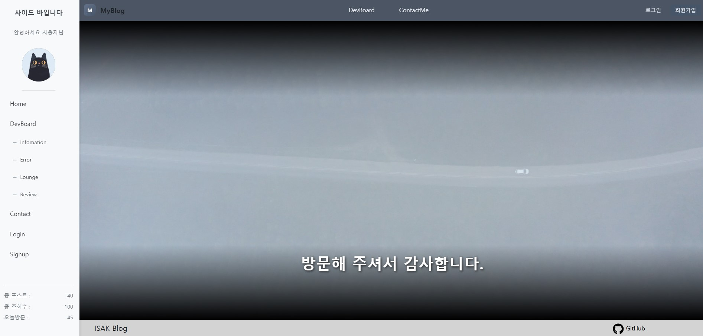
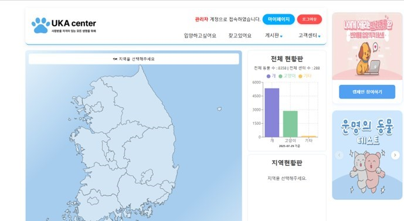
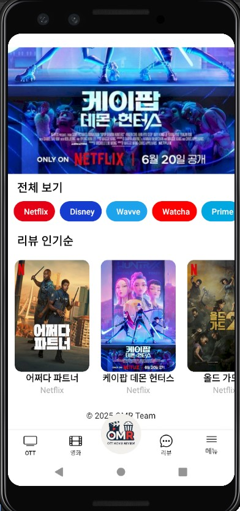
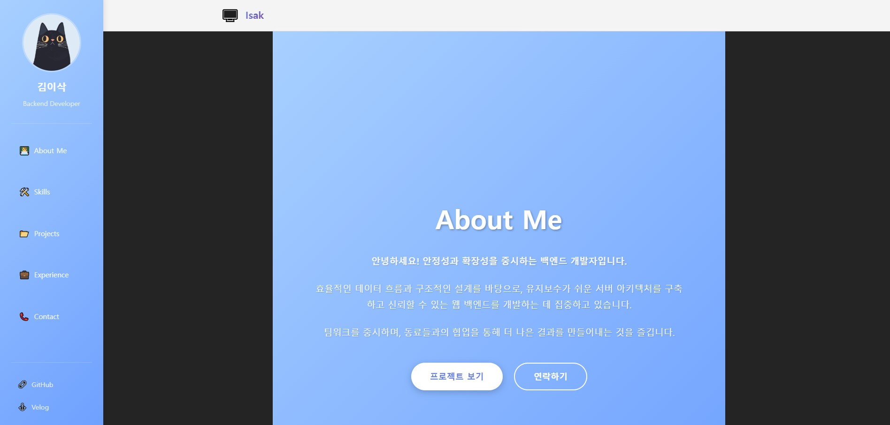

# 안녕하세요, 저는 풀스택 개발자입니다!

  
  
  
  

---

## 🌟 About Me

안녕하세요! 웹 개발과 모바일 앱 개발에 관심이 많은 개발자입니다. 🚀  
주로 **React**,**Java**, **Spring Boot**, **AWS**를 사용해서 프로젝트를 진행하고 있고,  
사용자 경험을 고려한 직관적인 서비스를 만들기 위해 노력하고 있습니다.  

새로운 기술을 배우는 것을 좋아하며, 코드 한 줄 한 줄에 의미를 담으려 합니다. ✨

---

## 📫 Contact Me

  
  
  
  
  

  

---

## 🚀 Projects

<table>
<tr>
<td width="50%">

### 💻 개인 프로젝트

**개인적인 학습과 실험을 위한 프로젝트**
- 🛠️ **Tech Stack**: React, Spring Boot, MySQL
- ⚡ **Features**: 사용자 인증, CRUD 기능, REST API
- 📅 **Status**: 완료

</td>
<td width="50%">

### 👥 팀 프로젝트

**팀원들과 처음 작업한 웹 페이지**
- 🛠️ **Tech Stack**: React, Node.js, MySQL
- 👨‍💻 **My Role**: Frontend 개발 및 UI/UX 디자인
- 📅 **Status**: 완료

</td>
</tr>
<tr>
<td width="50%">

### 🎯 팀 프로젝트2

**팀원들과 협업하여 진행한 어플리케이션**
- 🛠️ **Tech Stack**: React Native, Spring Boot
- 👨‍💻 **My Role**: 모바일 앱 개발 및 백엔드 API 연동
- 📅 **Status**: 진행 중

</td>
<td width="50%">

### 📄 깃허브 페이지 만들기

**GitHub Pages를 활용한 포트폴리오 웹사이트**
- 🛠️ **Tech Stack**: HTML5, CSS3, JavaScript
- ⚡ **Features**: 개인 포트폴리오 및 프로젝트 소개
- 📅 **Status**: 완료

</td>
</tr>
</table>

---

## 🛠️ Tech Stack

### 🎨 Frontend

### ⚙️ Backend

### 🗄️ Database

### 🔧 Tools & Others

---

## 📊 GitHub Statistics

  
  

  

---

## 📈 Activity Graph

  

---

## 🏆 GitHub Trophies

  

---

  
  ### "항상 배우고, 성장하며, 더 나은 코드를 작성하기 위해 노력합니다" 🌱
  
  
  

